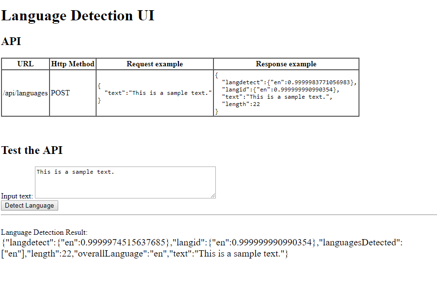
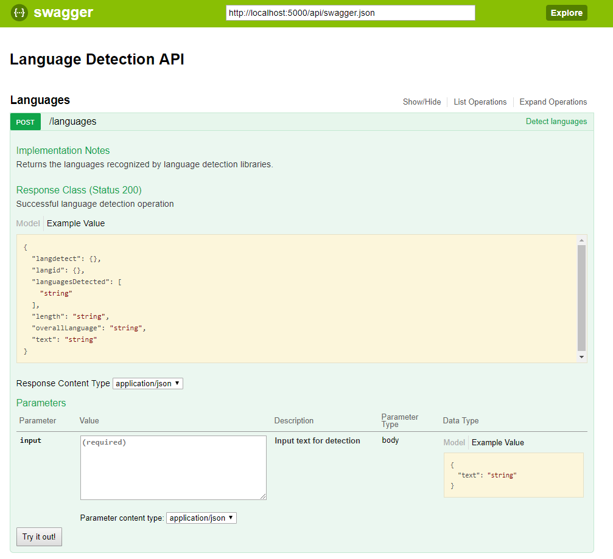

# Language detection service

- Service is using the Flask framework
- Libraries for detection: Langid.py, Langdetect
- Can be packaged and deployed as a microservice
- Swagger API documentation and UI included
- Support MS Office and PDF file upload

## Setup

Platform requirements:
- Python 3.6 (recommended python version)
- Java 8 (for the tika library)

To be able to process documents you need the tika library.
Download the tika-app.jar file from https://tika.apache.org/ and place it into the lib/ folder.
For example using wget:
```
wget http://www-eu.apache.org/dist/tika/tika-app-1.18.jar -P src/lib/
```

Install required python libraries:
```
pip install -r requirements.txt
```

## Run - Development mode
```
cd src
python main.py
```
Navigate to http://localhost:5000/


## Run - Production mode using Gunicorn
```
cd src
gunicorn --config gunicorn_config.py main:app
```
Navigate to http://localhost:5000/

Note: Windows is not supported by Gunicorn.


## Run in Docker - recommended

### Run using docker-compose

Build/rebuild the container (build). Start the container (up). 
```
docker-compose build
docker-compose up
```

You can now access the application on port 80.


### Run using docker

Build the container and start
```
docker build -t language-detection .
docker run -d -p 80:5000 --name language-detection language-detection
```

You can now access the application on port 80.

To stop the container:
```
docker container stop language-detection
```


# Frontend & API

## Frontend - Work in progress

Right now the application has a basic UI:




## Swagger UI - API Documentation

Navigate to http://localhost:5000/api/ui/

You should see the Swagger UI:



